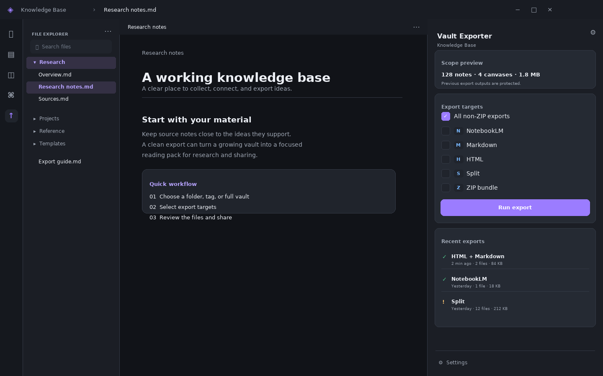
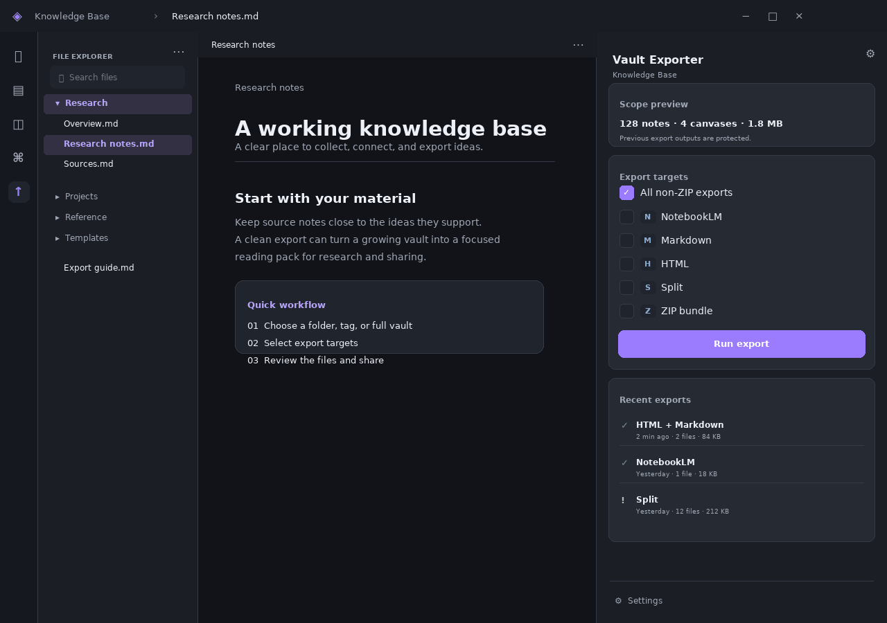
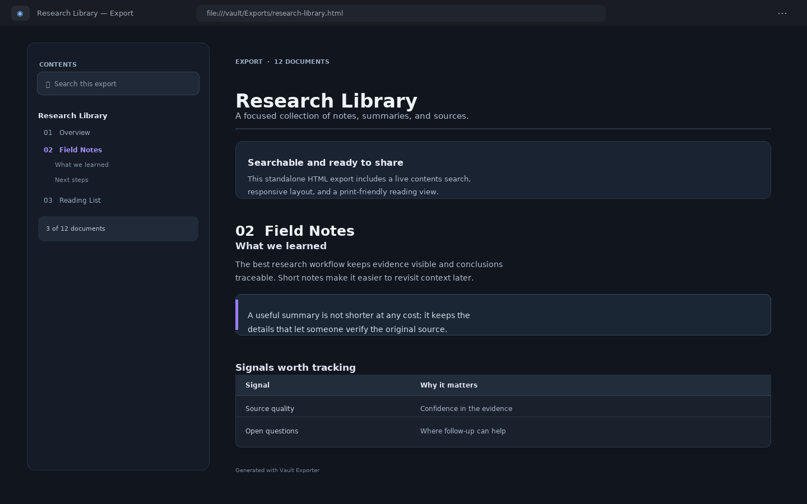

# Vault Exporter

An Obsidian desktop plugin for turning a vault, folder, or tagged subset into files ready to read, share, or upload.

> **UI preview.** The images below are illustrative mock-ups, not screenshots from a running Obsidian instance. The plugin uses your Obsidian theme and may look different.





## Export formats

| Target | Output |
|---|---|
| **NotebookLM** | One structured `.txt` file with clear note boundaries and optional metadata. |
| **HTML** | A styled document with a searchable table of contents, customizable system/light/dark theme, and print layout. |
| **Markdown** | One `.md` file with an anchored table of contents. |
| **Split** | One `.txt` per folder, or one cleaned `.md` file per note. |
| **ZIP bundle** | A portable archive containing all three consolidated formats and split files. The ZIP is a separate target. |



## Use it

1. Open the **Vault Exporter** sidebar from the ribbon, or use the Command Palette.
2. Choose targets and select **Run export**. The sidebar summarizes the selected target count and formats. Select **All non-ZIP exports** for NotebookLM, HTML, Markdown, and split output; **ZIP bundle** is a separate target.
3. Track live progress and elapsed time, cancel a run, and review the file count, size, skipped notes, and duration when it finishes. Reveal the output manually from the panel, or enable automatic reveal on success.

**Settings** in the sidebar footer opens this plugin’s settings page directly; the **Open Vault Exporter settings** command does the same from the Command Palette, so you can assign it a hotkey.

The sidebar also shows a scope preview and the five most recent runs, including each run’s duration. It remembers your selected export targets by default; turn this off in **Settings → General** to start with all targets instead. Use a history row’s folder button to reveal its first output, or clear the history without deleting exported files. When a tag filter is active, the preview is path-based and the sidebar says so; Canvas files are not included in tag-scoped exports. The sidebar and progress panel adapt to narrower and shorter windows, with larger touch targets.

### Scope and content

Use **Scope Root** to limit exports to a vault folder and **Scope Tag** to include notes with a matching frontmatter or inline tag. Excluded folders, files, and folder prefixes apply to both. Previous exporter outputs are automatically excluded, so repeat runs do not ingest their own files.

The cleaning pipeline can strip YAML frontmatter, remove Obsidian comments, convert wikilinks in four modes, include Canvas text in visual order, and render a supported subset of Dataview `TABLE`/`LIST` queries to static Markdown. Supported filters include `and`/`or`, comparisons, `in`, `like`, and `contains`/`startswith`/`endswith`. Unsupported Dataview blocks are left intact rather than evaluated as if they matched everything.

Use the **current note** commands to export its folder or create a clean Markdown copy beside it. These commands temporarily override scope and output settings; saved settings are unchanged.

## Install

Download `main.js`, `manifest.json`, and `styles.css` from the [latest release](https://github.com/aznan-triks/true-condensated-vault-exporter/releases). Copy them to:

```text
<your-vault>/.obsidian/plugins/vault-exporter/
```

Then reload Obsidian and enable **Vault Exporter** in **Settings → Community plugins**. For a local build, run `npm ci` followed by `npm run build`, then copy the same three files.

## Settings worth knowing

The settings page is grouped and searchable: type a setting name or description to narrow the list.

- **Scope Root / Scope Tag** and exclusion lists control what is read.
- Each consolidated format, the ZIP, and split files have configurable output paths. Use vault-relative paths or absolute paths on desktop; a blank split destination means the vault root.
- **External Output Folder** redirects every output outside the vault. Turn it on, pick an absolute folder with the system folder picker, and all consolidated files, ZIP bundles, and split files are written there instead — relative paths keep their subfolders, absolute paths keep only their final name. The section shows where exports currently go, and the sidebar footer and scope preview both link to these settings. Outputs written back inside the vault (for example when the external folder is a vault subfolder) are still protected from re-export.
- Split mode chooses folder-grouped text files or a one-to-one Markdown mirror.
- Markdown-processing settings control frontmatter, Dataview, Canvas, wikilinks, and ignored properties.
- **Export Feedback & Behavior** lets you keep successful progress panels open or choose their auto-close delay. Cancelled and failed panels remain visible for review. You can also reveal the first output automatically in the desktop file manager.
- **HTML Personalization** lets you choose system/light/dark appearance, accent color, typography, reading width, navigation/search, source paths, metadata badges, and footer attribution. A live preview reflects theme, accent, typography, and width changes. These choices only affect the standalone HTML export. **Advanced** still includes custom HTML CSS and UI yield frequency.

Markdown links point to vault-root-relative paths, not paths relative to each exported file. Consolidated Markdown and HTML work best at the vault root; links may need adjustment for outputs saved elsewhere, especially split Markdown mirrors. Unreadable notes are skipped and reported. Files already written are kept if an export is cancelled.

## Development

```bash
npm ci
npm run check    # TypeScript, unit tests, production build, mock-Obsidian smoke test
npm run test     # Vitest only
npm run smoke    # load and exercise main.js against a mock Obsidian (needs a build)
npm run dev      # esbuild watch mode
```

The core is dependency-light TypeScript; Obsidian and Node APIs stay behind the vault gateway. The ZIP writer uses Node's built-in `zlib` and supports standard ZIP32 limits.

`tools/mock-obsidian/` runs the real bundle the way Obsidian does — CommonJS load with host-provided `obsidian`/`electron`, jsdom for the DOM, and a temporary vault on disk. It catches load-time crashes and regressions in the user-facing flows without an Obsidian instance, and it types itself against the same API surface the plugin targets (see `minAppVersion` in `manifest.json`).
